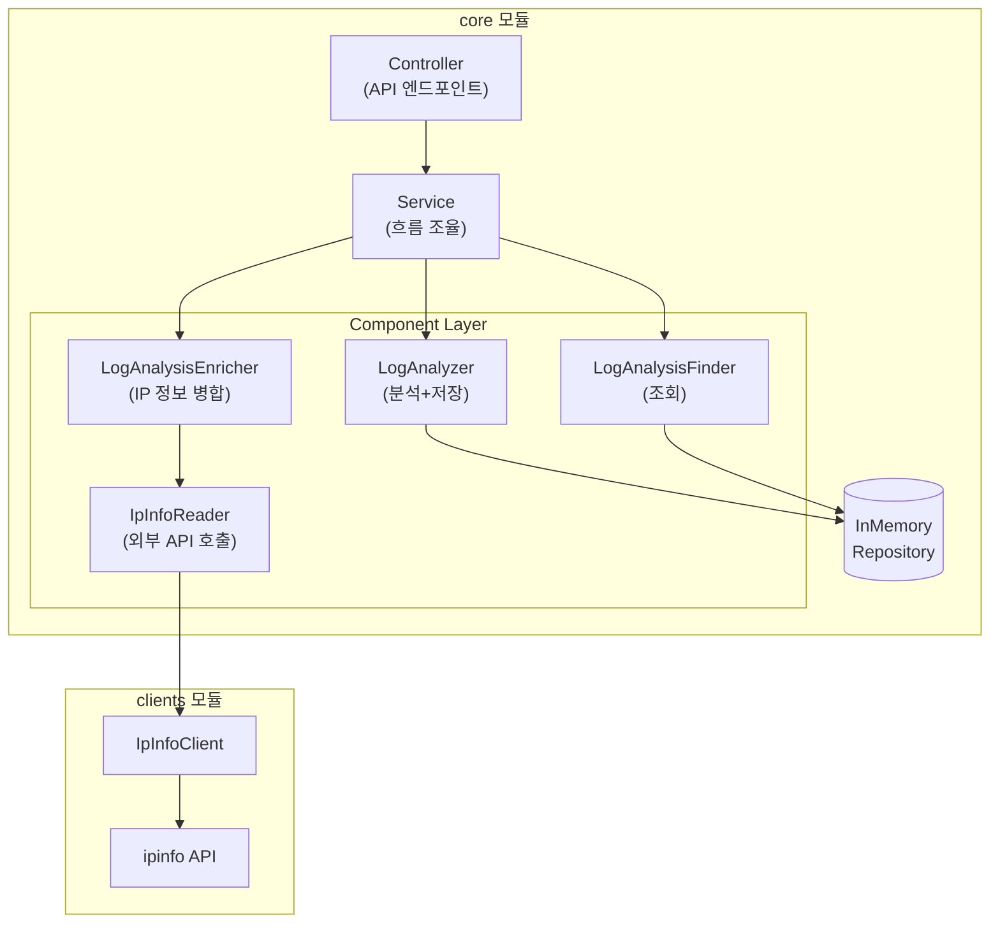

# Log Analyzer API

웹 접속 로그(CSV)를 분석하여 통계를 집계하고, IP 정보를 조회하여 enrichment된 리포트를 제공하는 백엔드 API입니다.

---

## 실행 방법

### 프로젝트 클론

```bash
git clone https://github.com/NaMinhyeok/log-analyzer.git
cd log-analyzer
```

### 환경변수 설정

```bash
export IPINFO_TOKEN=your_token_here
```

> ipinfo 토큰은 [ipinfo.io](https://ipinfo.io)에서 무료로 발급받을 수 있습니다.

### 애플리케이션 실행

```bash
./gradlew :core:bootRun
```

### 테스트 실행

```bash
./gradlew test
```

### API 호출

`http/api.http` 파일에 샘플 요청이 준비되어 있습니다.

- **IntelliJ IDEA**: 파일 열고 요청 옆 ▶ 버튼 클릭 (추가 설치 불필요)
- **기타 IDE**: Swagger UI (`http://localhost:8080/swagger-ui.html`)에서 테스트

---

## 가장 중요하다고 판단한 기능

### 1. 스트리밍 CSV 파싱

대용량 파일(50MB/200K lines)을 처리하기 위해 **메모리에 전체 파일을 올리지 않고 라인 단위로 스트리밍 처리**합니다.

- `BufferedReader.lines()`로 lazy하게 한 줄씩 처리
- 파싱과 집계를 단일 패스로 수행하여 메모리 사용량 최소화
- 파싱 오류 라인은 스킵하되, 오류 개수와 샘플을 결과에 포함

### 2. IP 정보 조회 안정성

외부 API(ipinfo) 의존성으로 인한 장애를 방지하기 위해 **다층 방어 전략**을 적용했습니다.

| 전략          | 설정값                        | 목적                           |
|-------------|----------------------------|------------------------------|
| Caffeine 캐시 | TTL 60분, 최대 1000개          | 동일 IP 중복 조회 방지               |
| Retry       | 최대 3회, exponential backoff | 일시적 장애 대응                    |
| Fallback    | UNKNOWN 반환                 | 조회 실패 시 graceful degradation |

---

## 설계 요약

| 항목      | 선택                       | 이유                                                                                                                                                                             |
|---------|--------------------------|--------------------------------------------------------------------------------------------------------------------------------------------------------------------------------|
| **파서**  | `BufferedReader` + 직접 구현 | Apache Commons CSV 같은 외부 라이브러리 의존 없이 가볍게 유지. 요구사항이 "따옴표 내 쉼표 처리" 정도로 단순했고, `BufferedReader.lines()`와 자연스럽게 통합하여 스트리밍 처리에 집중                                                    |
| **캐시**  | Caffeine                 | ConcurrentHashMap으로 직접 구현하면 TTL, 최대 크기 제한, eviction 정책 등을 직접 구현해야 함. Caffeine은 이를 기본 제공하고 API도 간단. TTL은 `expireAfterWrite`(저장 후 만료) 방식을 사용해서, 자주 조회되는 IP도 주기적으로 최신 정보로 갱신되도록 함 |
| **재시도** | Resilience4j Retry       | `application.yml`에서 선언적으로 재시도 정책(횟수, 백오프 간격)을 설정할 수 있어서 코드 변경 없이 정책 조정 가능                                                                                                      |
| **구조**  | 멀티모듈 + Component 레이어     | 외부 클라이언트 설정을 `clients` 모듈로 분리하고, Service → Component 구조로 책임을 나눠 테스트와 유지보수 용이하게 설계                                                                                              |

### 아키텍처 다이어그램



### 멀티모듈 구조

```
log-analyzer-api/
├── core/      # API 레이어 + 도메인 + 인프라
└── clients/   # 순수한 외부 API 클라이언트 (설정 분리)
```

### Service → Component 레이어

| Component             | 역할                    |
|-----------------------|-----------------------|
| `LogAnalyzer`         | CSV 파싱 → 집계 → 저장      |
| `LogAnalysisFinder`   | Repository 조회 래핑      |
| `LogAnalysisEnricher` | 분석 결과 + IP 정보 병합      |
| `IpInfoReader`        | 외부 API 호출 (캐시/재시도 포함) |

**왜 이렇게 했는가?**

- **테스트 용이성**: Component 단위로 독립적인 테스트 가능
- **유지보수성**: 책임이 명확히 분리되어 변경 영향 최소화
- **응집도**: 관련 로직이 한 곳에 모여 있어 이해하기 쉬움

### 응집도 높은 도메인 모델 사용

```java
// 도메인 객체가 자신의 생성 방법을 알고 있음
public record AccessLog(...) {
    public static AccessLog from(CsvRow row) {
        // 검증 + 파싱 + 생성 로직이 도메인에 위치
    }
}
```

- 별도 Mapper 클래스 없이 **도메인에 변환 로직 포함**
- 변환 로직이 도메인과 함께 있어 **응집도** 높음

---

## 특히 신경 쓴 부분

### Callback 방식 리소스 관리

```java
// CsvParser.java
public static void parse(InputStream inputStream, Consumer<Stream<CsvRow>> consumer) {
    try (BufferedReader reader = new BufferedReader(...)){
        Stream<CsvRow> stream = reader.lines()...;
        consumer.accept(stream);  // Consumer 내부에서만 Stream 사용 가능
    }  // try 블록을 벗어나면 자동으로 리소스 정리
}
```

**왜 이렇게 했는가?**

- 호출자가 `close()`를 잊어도 리소스 누수가 발생하지 않음
- Stream의 생명주기를 CsvParser가 완전히 관리
- 호출자는 비즈니스 로직에만 집중 가능

### 테스트에서 Mock 대신 Fake 사용

```java
// FakeIpInfoClient.java - 실제로 동작하는 테스트용 구현체
public class FakeIpInfoClient implements IpInfoClient {
    public FakeIpInfoClient withIpInfo(String ip, String country, ...) {
        ipInfoMap.put(ip, new IpInfo(...));
        return this;  // Builder 패턴으로 테스트 데이터 설정
    }

    public int getCallCount(String ip) {
        return (int) calledIps.stream().filter(ip::equals).count();
    }
}
```

**Mock의 행위 검증 vs Fake의 상태 검증:**

```java
// Mock (행위 검증) - "이 메서드가 호출되었는가?"
verify(mockClient, times(1)).

getIpInfo("8.8.8.8");

// Fake (상태 검증) - "결과 상태가 기대한 대로인가?"
then(fakeClient.getCallCount("8.8.8.8")).

isEqualTo(1);
```

**왜 Fake를 선호하는가?**

- Mock의 `verify()`는 **내부 구현에 의존** → 리팩토링하면 테스트가 깨지기 쉬움
- Fake는 실제 동작하는 구현체라서 **"어떻게 호출하든 결과만 맞으면 됨"** → 리팩토링에 강함
- 테스트 코드가 더 **명시적이고 읽기 쉬움**

---

## API 명세

### 엔드포인트

| Method | URL                                          | 설명                         |
|--------|----------------------------------------------|----------------------------|
| `POST` | `/api/logs/v1/analyze`                       | 로그 파일 업로드 및 분석 (동기)        |
| `POST` | `/api/logs/v2/analyze`                       | 로그 파일 업로드 및 분석 (비동기 IP 조회) |
| `GET`  | `/api/logs/v1/analysis/{analysisId}?topN=10` | 분석 결과 조회                   |

### 요청/응답 요약

**분석 요청** (`POST /api/logs/v1/analyze`)

- Content-Type: `multipart/form-data`
- Body: `file` (CSV 파일)

**분석 응답**

```json
{
  "result": "SUCCESS",
  "data": {
    "analysisId": 1
  }
}
```

**결과 조회 응답** (`GET /api/logs/v1/analysis/1?topN=5`)

| 필드                               | 설명                                       |
|----------------------------------|------------------------------------------|
| `summary.totalRequests`          | 총 요청 수                                   |
| `summary.statusCodeDistribution` | 2xx/3xx/4xx/5xx 비율                       |
| `topPaths`                       | 상위 N개 요청 경로                              |
| `topStatusCodes`                 | 상위 N개 상태 코드                              |
| `topClientIps`                   | 상위 N개 IP (country, region, city, org 포함) |
| `parseErrorCount`                | 파싱 오류 개수                                 |
| `parseErrorSamples`              | 파싱 오류 샘플 (최대 10개)                        |

> 전체 응답 스키마는 Swagger UI에서 확인할 수 있습니다: `http://localhost:8080/swagger-ui.html`

---

## 실 서비스 운영 시 개선 포인트

### 1. 영속성 저장소 도입

**현재**: 인메모리 저장 (서버 재시작 시 데이터 유실)

**개선 방향**:

- Redis 또는 RDB 도입으로 데이터 영구 보관
- 여러 인스턴스 간 분석 결과 공유

**추가 고려 사항**:

- 테이블 설계: `log_analysis`, `log_entry`, `parse_error` 등 정규화 수준 결정
- 인덱스 설계: `analysisId` 기반 조회, `clientIp`/`path` 집계 쿼리 최적화
- 대용량 집계 데이터의 JSON 컬럼 vs 정규화 테이블 트레이드오프

### 2. 비동기 IP 조회 고도화

**현재 구현의 한계**:

| 항목    | 현재 상태                              | 문제점                             | 개선 방향                                    |
|-------|------------------------------------|---------------------------------|------------------------------------------|
| 실패 처리 | API 호출 실패 시 UNKNOWN으로 저장하고 끝       | 일시적 네트워크 장애여도 재시도 없이 포기         | 실패한 IP를 재시도 큐에 넣고, 최대 N회까지 다시 시도         |
| 큐 크기  | 제한 없는 큐 사용 (`LinkedBlockingQueue`) | IP 10만 개가 한꺼번에 들어오면 메모리에 다 쌓임   | 큐 크기 제한 (예: 1000개) + 가득 차면 새 요청 거부 또는 대기 |
| 에러 구분 | 모든 예외를 동일하게 "실패" 처리                | 재시도하면 될 에러와 재시도해도 안 될 에러를 구분 못함 | 에러 종류별로 다른 전략 적용 (아래 표 참고)               |
| 워커 수  | 1개 스레드가 순차 처리                      | IP 1000개 처리 시 1000번 순차 호출 → 느림  | 워커 여러 개로 병렬 처리 (단, 외부 API 레이트리밋 고려)      |

**에러 종류별 처리 전략 예시**:

| 에러 종류                   | 의미               | 처리 전략                        |
|-------------------------|------------------|------------------------------|
| `429 Too Many Requests` | 외부 API 호출 한도 초과  | 재시도 큐에 넣고 시간 간격을 늘려가며 재시도    |
| `404 Not Found`         | 존재하지 않는 IP       | 재시도해도 결과 동일하므로 즉시 UNKNOWN 처리 |
| `5xx` / `Timeout`       | 서버 장애 또는 네트워크 문제 | 재시도 큐에 넣고 일정 횟수 후 포기         |

---

## 기술 스택

| 카테고리      | 기술                          |
|-----------|-----------------------------|
| Language  | Java 25                     |
| Framework | Spring Boot 4.x             |
| Build     | Gradle (멀티모듈)               |
| Cache     | Caffeine                    |
| Retry     | Resilience4j                |
| API Docs  | SpringDoc OpenAPI (Swagger) |
| Test      | JUnit 5, Awaitility         |
